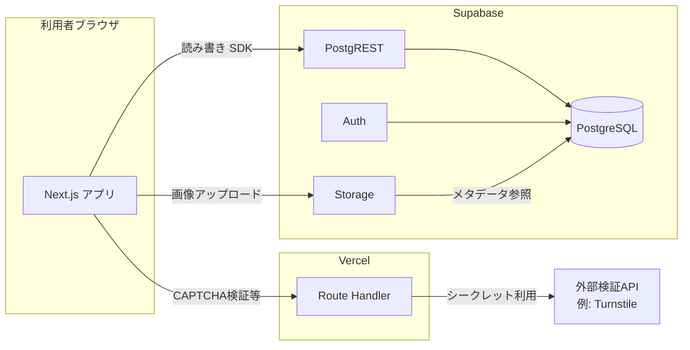

# システムアーキテクチャ

> **注意（2026-04）**：**現在のプロダクト方針**は [static-site-strategy.md](../static-site-strategy.md) を参照。本ファイルは **Next.js + Supabase** 前提の**歴史的記録**です（**Next.js はリポジトリから撤去済み**、2026-04）。

本ドキュメントは、イベント（投稿）の登録・一覧表示・管理者による削除を行うWebアプリについて、これまでの検討結果を前提とした**採用サービスと技術**を整理したものです。

## 目的とスコープ

| 機能 | 内容 |
|------|------|
| 投稿 | タイトル、本文、期間（開始日・終了日）、URL、画像（1枚想定）、<strong>投稿者表示名</strong>・**X（旧Twitter）識別子**（いずれも必須。詳細は [functional-spec.md](./functional-spec.md)） |
| 一覧 | 投稿を**カード**で表示。**ページネーション**で遷移。特定投稿の共有 URL は **一覧＋`?post=`** のディープリンク（詳細ページは設けない。 [functional-spec.md](./functional-spec.md) **FR-18**）。 |
| 管理 | 管理者のみ投稿の削除 |

**非機能要件（検討済みの方針）**

- 投稿・表示の体感速度に配慮する（具体的な数値SLOは未設定）。
- ボット等の悪用を抑止する（CAPTCHA等は別途実装方針）。
- 不正アクセスを許さない（RLS・認証設計で担保）。

**SEO**は優先しない。

## 構成概要

## 採用サービス

| 役割 | サービス | 利用内容 |
|------|----------|----------|
| フロントエンドのホスティング・実行 | **Vercel** | Next.js をデプロイ。無料枠（Hobby）を前提に利用。帯域・ビルド時間等の上限は [Vercel Pricing](https://vercel.com/pricing) で随時確認。 |
| データベース・API・認証・ファイル | **Supabase** | PostgreSQL、行単位アクセス制御（RLS）、プロジェクト自動API（PostgREST）、認証（Auth）、オブジェクトストレージ（Storage）。公式: [Supabase](https://supabase.com) |
| 運用通知（手動 X 投稿の補助） | **Discord**（Incoming Webhook） | 投稿が保存されたあと **Route Handler** 等から Webhook へ通知し、<strong>X にコピペしやすい文案</strong>を受け取る。X の書き込み API は使わない。要件は [functional-spec.md](./functional-spec.md) **FR-17**。Webhook URL は **Vercel の環境変数（非公開）**にのみ格納。 |

## 採用技術

| 層 | 技術 | 役割 |
|----|------|------|
| フロントエンド | **Next.js**（App Router 想定） | UI、一覧・フォーム、管理者向け操作画面。 |
| HTTP クライアント | **標準 `fetch`** | **axios は使用しない**（方針）。外部 API（Turnstile 検証・Discord Webhook 等）も `fetch`。 |
| クライアントからDBへ | **@supabase/supabase-js** | 匿名・ログイン後のクエリ、Storage 操作用。 |
| 環境変数 | `NEXT_PUBLIC_SUPABASE_URL` / `NEXT_PUBLIC_SUPABASE_ANON_KEY` | フロントから接続する公開情報（**実際の権限はRLSで最小化**）。 |
| データベース | **PostgreSQL**（Supabase管理） | 投稿メタデータ、投稿者情報、画像パス等。 |
| アクセス制御 | **Row Level Security（RLS）** | 公開は主に SELECT。**INSERT** は仕様（Turnstile ＋ Route Handler 等）に合わせて anon 禁止・**サーバ（service_role）のみ**等を検討。**DELETE は下記「管理者の認定」に一致する `authenticated` のみ**。Storage も RLS で整合。 |
| 画像 | **Supabase Storage** | 1枚アップロード想定。DBにはファイル本体ではなく**パスまたは公開URL**を保持する方針。 |
| 管理者認証 | **Supabase Auth** | **1名のみ**（運用者本人）。認定ルールは下記。 |

### 管理者の認定（確定・1名のみ）

**方針**：増員しない前提で **単純・ブルートフォースに強い構成**に寄せる。**JWT（メールクレーム）と RLS** で削除権限を1人に限定する。**クライアントへ `service_role` は渡さない**（管理者も **anon キー＋ログイン済みセッション**で `delete` を呼び、<strong>RLS が許可するのはそのメールのユーザだけ</strong>にする形が望ましい）。

| 項目 | 内容 |
|------|------|
| 誰が管理者か | **あなたのメールアドレス1件**のみ（Supabase Auth に登録されているアドレスと**完全一致**で比較。必要なら SQL 側で `lower()` 等で正規化）。 |
| 新規アカウント可否 | Supabase の **Auth 設定で「一般ユーザーの新規サインアップを無効」**にする（または Invite のみ）。**第三者が `authenticated` になれない**ようにするのが重要。 |
| 管理者の作り方 | Dashboard で **自分のアドレスにユーザーを1件作成**するか、<strong>マジックリンク／パスワード</strong>で本人だけがログインできる状態にする。 |
| RLS（例） | `posts` の `DELETE` は `auth.role() = 'authenticated'` かつ **`(auth.jwt() ->> 'email')` が許可メールと一致**するときのみ `USING true`（許可メールは **SQL マイグレーションに1定数**として記載するのが実装しやすい。公開リポジトリならメール露出の取り扱いに注意）。 |
| ログインUI | 推奨：**マジックリンク**（パスワード漏えい面の運用が減る）。**強いパスワード＋必要なら 2FA** でもよい（Supabase の提供範囲に従う）。 |
| 管理URL | `/admin` 等は推測されにくくしても、<strong>RLS により認証なしでは削除できない</strong>ので必須ではないが、<strong>ボットの試行対策</strong>としてパスをやや長くする・Basic を併用するなどは任意。 |

**補足（メールではなく ID で縛る場合）**：メール変更の心配がなければ上記で十分。変更しうる場合は、初回ログイン後の **`auth.uid()` を SQL で確認し、その UUID をポリシーに直書き**する方法もある（1名のみ向き）。

## セキュリティ・運用上の前提

1. **anon（公開）キー**はブラウザに含まれる前提でよいが、<strong>そのキーで可能な操作はRLSで制限</strong>する。
2. **service_role** キー等の高権限シークレットは**Vercelの環境変数**にのみ格納し、クライアントに載せない。
3. **CAPTCHA**（例: Cloudflare Turnstile）は、トークン検証を **Next.js の Route Handler** 等で行い、検証成功後のみ Supabase へ書き込みする流れを想定（手間を抑えつつ秘密鍵をサーバ側に置ける）。
4. **投稿時の認証**は [functional-spec.md](./functional-spec.md) **§1.4 案 A**（**ログイン不要**、X 識別子は**フォーム手入力**）とする。歓迎しない投稿の抑止（レート制限、承認制、モデレーション等）は**別途方針を決めてから**実装する。

## 未確定・別途検討

- スパム・不適切投稿の具体的な防御・運用（CAPTCHA以外のレイヤ）。認証案別の整理は functional-spec を参照。
- 画像バケットの公開範囲（公開読み取り／署名付きURL等）。

## 関連ドキュメント

- [static-site-strategy.md](../static-site-strategy.md) … **静的サイト（Astro 予定）・フォーム／シート中心**の意思決定整理。
- [functional-spec.md](./functional-spec.md) … 機能仕様（旧・Supabase 案。新方針と食い違う箇所あり）。

## 参考リンク

- [Supabase Documentation](https://supabase.com/docs)
- [Next.js Documentation](https://nextjs.org/docs)
- [Vercel Documentation](https://vercel.com/docs)
