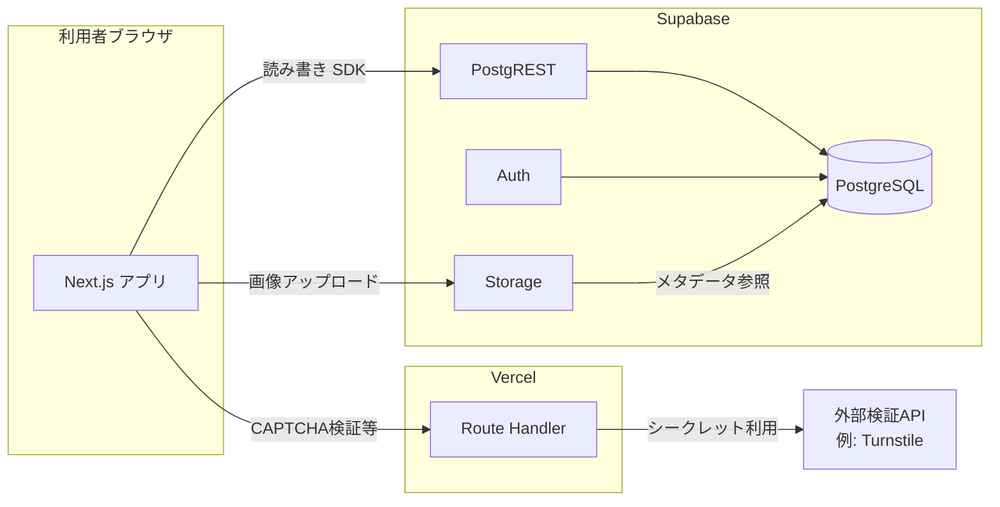

# システムアーキテクチャ

本ドキュメントは、イベント（投稿）の登録・一覧表示・管理者による削除を行うWebアプリについて、これまでの検討結果を前提とした**採用サービスと技術**を整理したものです。

## 目的とスコープ

| 機能 | 内容 |
|------|------|
| 投稿 | タイトル、本文、期間（開始日・終了日）、URL、画像（1枚想定）、投稿者情報（Twitterアカウント等を含む可） |
| 一覧 | 投稿内容の一覧表示 |
| 管理 | 管理者のみ投稿の削除 |

**非機能要件（検討済みの方針）**

- 投稿・表示の体感速度に配慮する（具体的な数値SLOは未設定）。
- ボット等の悪用を抑止する（CAPTCHA等は別途実装方針）。
- 不正アクセスを許さない（RLS・認証設計で担保）。

**SEO**は優先しない。

## 構成概要

## 採用サービス

| 役割 | サービス | 利用内容 |
|------|----------|----------|
| フロントエンドのホスティング・実行 | **Vercel** | Next.js をデプロイ。無料枠（Hobby）を前提に利用。帯域・ビルド時間等の上限は [Vercel Pricing](https://vercel.com/pricing) で随時確認。 |
| データベース・API・認証・ファイル | **Supabase** | PostgreSQL、行単位アクセス制御（RLS）、プロジェクト自動API（PostgREST）、認証（Auth）、オブジェクトストレージ（Storage）。公式: [Supabase](https://supabase.com) |

## 採用技術

| 層 | 技術 | 役割 |
|----|------|------|
| フロントエンド | **Next.js**（App Router 想定） | UI、一覧・フォーム、管理者向け操作画面。 |
| クライアントからDBへ | **@supabase/supabase-js** | 匿名・ログイン後のクエリ、Storage 操作用。 |
| 環境変数 | `NEXT_PUBLIC_SUPABASE_URL` / `NEXT_PUBLIC_SUPABASE_ANON_KEY` | フロントから接続する公開情報（**実際の権限はRLSで最小化**）。 |
| データベース | **PostgreSQL**（Supabase管理） | 投稿メタデータ、投稿者情報、画像パス等。 |
| アクセス制御 | **Row Level Security（RLS）** | 例: 一覧は誰でもSELECT、匿名はINSERTのみ、DELETEは管理者のみ、等。ポリシーは要件確定後に具体化。 |
| 画像 | **Supabase Storage** | 1枚アップロード想定。DBにはファイル本体ではなく**パスまたは公開URL**を保持する方針。 |
| 管理者認証 | **Supabase Auth** | 管理者ログインに利用。`DELETE` 許可をRLSで管理者に限定。 |

## セキュリティ・運用上の前提

1. **anon（公開）キー**はブラウザに含まれる前提でよいが、**そのキーで可能な操作はRLSで制限**する。
2. **service_role** キー等の高権限シークレットは**Vercelの環境変数**にのみ格納し、クライアントに載せない。
3. **CAPTCHA**（例: Cloudflare Turnstile）は、トークン検証を **Next.js の Route Handler** 等で行い、検証成功後のみ Supabase へ書き込みする流れを想定（手間を抑えつつ秘密鍵をサーバ側に置ける）。
4. **匿名投稿**は許可する一方、歓迎しない投稿の抑止（レート制限、承認制、モデレーション等）は**別途方針を決めてから**実装する。

## 未確定・別途検討

- 匿名投稿に対するスパム・不適切投稿の具体的な防御・運用（CAPTCHA以外のレイヤ）。
- 管理者の定義方法（メールallowlist、ロールテーブル、`user_metadata` 等）。
- 画像バケットの公開範囲（公開読み取り／署名付きURL等）。

## 参考リンク

- [Supabase Documentation](https://supabase.com/docs)
- [Next.js Documentation](https://nextjs.org/docs)
- [Vercel Documentation](https://vercel.com/docs)
