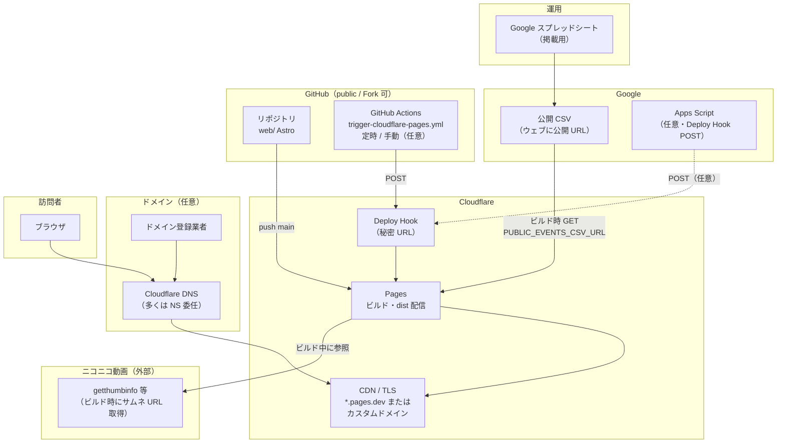
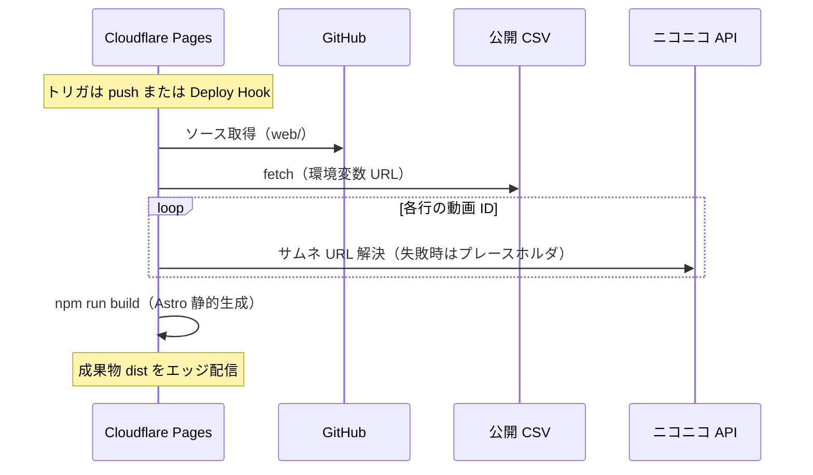
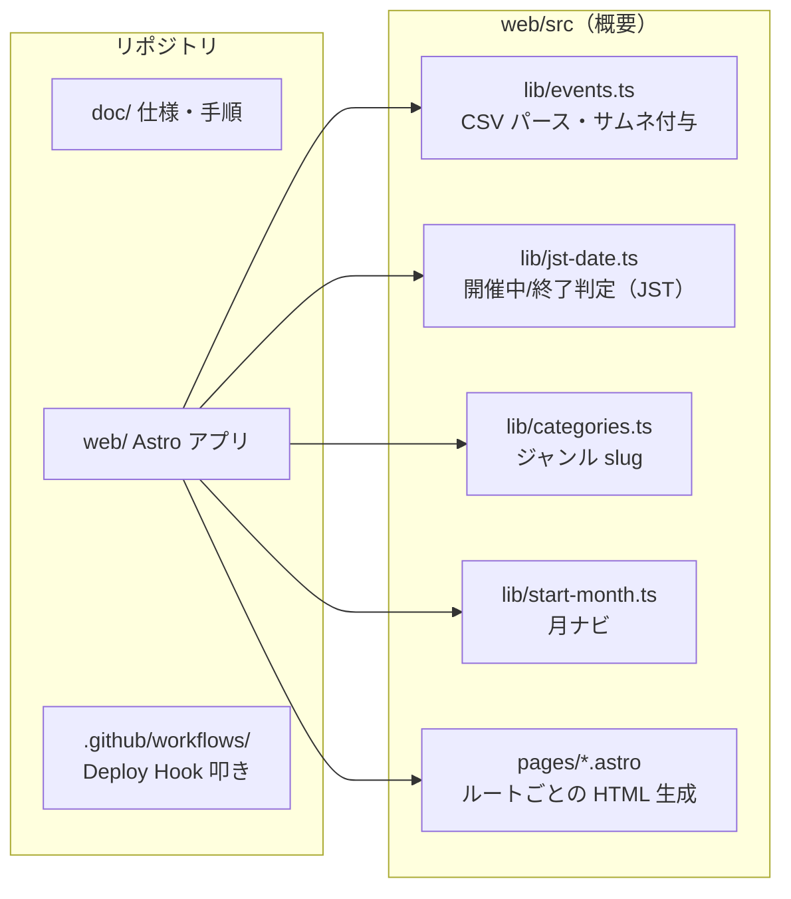

# サイト構成図（投稿祭スケジュール・非公式）

このドキュメントは **1 インスタンスあたりのシステム構成**と **Astro 静的サイトの内部**を図で示します。Fork 後は **各自の Cloudflare・CSV・Deploy Hook** が独立します。手順の詳細は [本番初回セットアップ手順.md](./本番初回セットアップ手順.md)・[運用手順書.md](./運用手順書.md)・[static-site-strategy.md](./static-site-strategy.md) を参照してください。

> **GitHub 上の表示:** Mermaid のノードラベル内にバッククォート（`）を入れると、GitHub のレンダラで構文エラーになることがあります。本文の図ではパスをコードフェンスなしの表記にしています。また、全角の読点の直後などで **太字** がそのまま表示されることがあります（区切りが難しい場合）。そのときは HTML の <strong>…</strong> が確実です。

---

## 1. システム全体（データの流れ）

静的ホスティングのため、<strong>一覧の中身はビルド時点の CSV と JST の「今日」</strong>で決まります。訪問者のブラウザが CSV を直接読むことはありません。

### ビルドが走るタイミング（要約）

| トリガ | 経路 |
|--------|------|
| `main` へ push | Cloudflare Pages の Git 連携 |
| Deploy Hook への POST | 定時 GitHub Actions・手動 Workflow・（任意）Apps Script |

---

## 2. ビルド時のデータフロー（Pages 上）

---

## 3. リポジトリとアプリ内部（`web/`）

---

## 4. 主要 URL（生成ページの例）

ビルド時に CSV からパスが決まるものと、固定のものがあります（実装は `web/src/pages/`）。

| 種別 | パス例 |
|------|--------|
| トップ・開催中 | `/`、`/upcoming/`、`/month/{YYYY-MM}/`、`/category/{slug}/`、`/upcoming/month/...`、`/upcoming/category/...` |
| 終了イベント | `/ended/`、`/ended/month/...`、`/ended/category/...` |
| その他 | `/terms/`（利用規約プレースホルダ） |

`/` と `/upcoming/` など役割が近いルートが並立している場合があります。対応の正は `web/src/pages/` を参照してください。

---

## 5. 環境変数・秘密（名称のみ）

| 場所 | 名前 | 役割 |
|------|------|------|
| Cloudflare Pages（ビルド） | `PUBLIC_EVENTS_CSV_URL` | 掲載用 CSV の URL |
| Cloudflare Pages（ビルド） | `NODE_VERSION` 等 | Node バージョン指定（必要に応じて） |
| Cloudflare Pages（ビルド） | `PUBLIC_CF_WEB_ANALYTICS_TOKEN` | Web Analytics（任意） |
| GitHub Actions | `CLOUDFLARE_PAGES_DEPLOY_HOOK_URL` | Deploy Hook の POST 先（任意） |
| Apps Script（任意） | `DEPLOY_HOOK_URL` 等 | 同上（スクリプト プロパティ） |

---

## 改訂履歴

| 日付 | 内容 |
|------|------|
| 2026-07-07 | GitHub public / 各自ホスティング向けにラベル・環境変数表を更新 |
| 2026-04-01 | 初版：システム全体・ビルドシーケンス・`web/` 概要・主要 URL |
| 2026-04-17 | Mermaid のバッククォート除去、GitHub で太字が効かない段落を `<strong>` に変更 |

---

## 関連ドキュメント

| ドキュメント | 内容 |
|--------------|------|
| [本番初回セットアップ手順.md](./本番初回セットアップ手順.md) | 初回の Cloudflare / GitHub / シート / DNS |
| [運用手順書.md](./運用手順書.md) | 日常運用・定時デプロイ |
| [static-site-strategy.md](./static-site-strategy.md) | 仕様・列定義・方針 |

